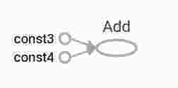

Tensorflow

Tensorflow provides multiple APIs. The lowest level API - TnesorFlow Core - provides us with complete programming control. The higher level APIs are built on the top of TensorFlow core. A higher level API like tf.estimator helps us to manage data sets, estimator, training and infrence.

The import statement of tensorflow -  
>import tensorflow as tf

THE COMPUTATIONAL GRAPH - 

A computational graph is a series of TensorFlow operations arranged into a graph of nodes. Each node takes zero or more tensors as input and produces a tensor as an output. One type of node is a constant.This constant node takes no input and it outputs a value it stores internally. Creating 2 floating point tensors node1, node2 as - 

>node1 = tf.constant(3.0, dtype=tf.float32)
node2 = tf.constant(4.0) # also tf.float32 implicitly
print node1, node2

The print statement produces - 
>Tensor("Const:0", shape=(), dtype=float32) Tensor("Const_1:0", shape=(), dtype=float32)

Notice that printing the nodes does not output the values 3.0 and 4.0 as one might have expected. Instead they are nodes that, when evalued, would produce 3.0 and 4.0 respectively. To actually evaluate the nodes, we must run the computational graph within a session.A session encapsulates the control and state of the TensorFlowr runtime.

>sess = tf.Session()
print sess.run([node1, node2])

The above code creates a Session object and then run method to run enough of the computational graph to evaluate node1 and node2.

Output will be - 

>[3.0, 4.0]

We can build more complicated computations by applying operations on these nodes - 

>from __future__ import print_function
node3 = tf.add(node1, node2)
print "node3:" + node3
print "sess.run(node3)"+sess.run(node3)

Output will be - 

>node3: Tensor("Add:0", shape=(), dtype=float32)
sess.run(node3): 7.0

TensorFlow provides a utility called TensorBoard that can display a picture of the computational graph. 
TensorBoard visuliazes the graph - 

Asit stands, this graph is not of our intrest because it always produces the constant output. 
A graph can be parametrized to accept external inputs, known as placeholders. A placeholder is a promise to privide a value later.

>a = tf.placeholder(tf.float32)
b = tf.placeholder(tf.float32)
adder_node = a + b # + provides a shortcut for td.add(a,b)

>print sess.run(adder_node, {a: 3, b: 4.5})
print sess.run(adder_node, {a: [1, 3], b: [2, 4]})

Resulting the output - 

>7.5
[3. 7.]

We can make computational graph more complex by adding another operation - 
>add_and_triple = adder_node * 3
print sess.run((add_and_triple, {a:3, b:4.5}))

produces the output
>22.5

In machine learning we will typically want a model that takes arbitrary inputs such as one above. To make the model trainable, we need to be able to modify the graph to get new outputs with the same input. Variables allow us to add trainable parameters to the graph. They are constructed with a type and initial value.

>W = tf.Variable([.3], dtype=tf.float32)
b=tf.Variable([-.3], dtype=tf.float32)
x = tf.placeholder(tf.float32)
linear_model = W * x + b

Constants are initalized when you call tf.constant, and their value can never change. By contrast, variables are not initalized when you call tf.Variable. To initialize the variables in a TensorFlow program, we must explictly call a special operation as follows - 

>init = tf.global_variables_initializer()
sess.run(init)

init is a handle to the TensorFlow sub-graph that initialzes all the global variables. Untill we call sess.run, the variables are uninitialized.

Since x is a placeholder, we can evaluate linear_model for several values of x simultaneously as follows-  
>print sess.run(linear_model, {x: [1,2,3,4]})

Output - 

>[0.	0.30000001  0.60000002 0.900000004]

We've ceated a model but we don't know how good it is yet. To evaluate the model on training data, we need a y placeholder to provide the desired values, and we need to write a loss function.

